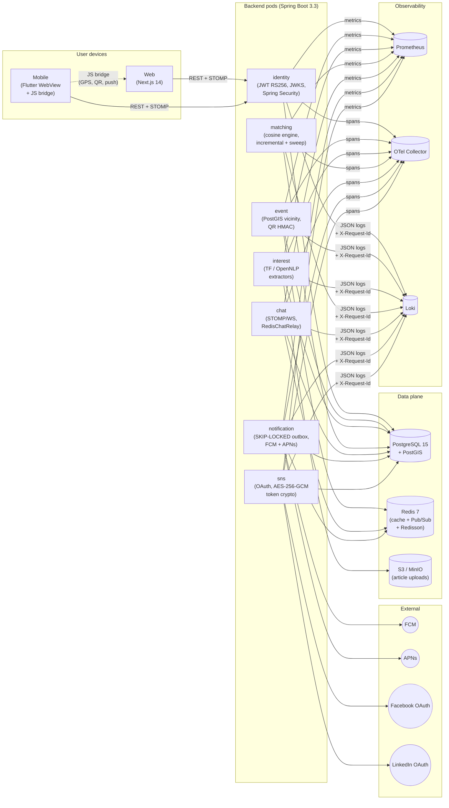
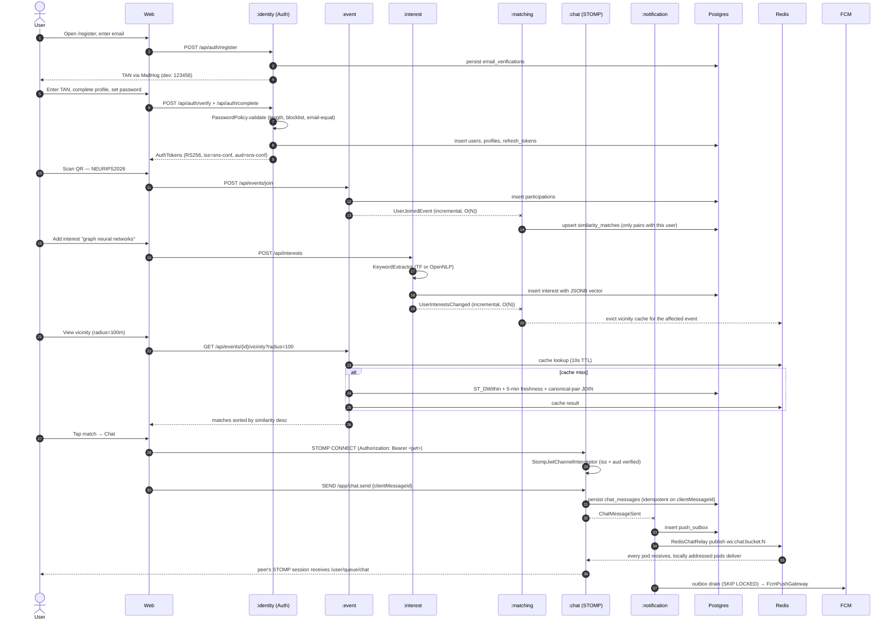
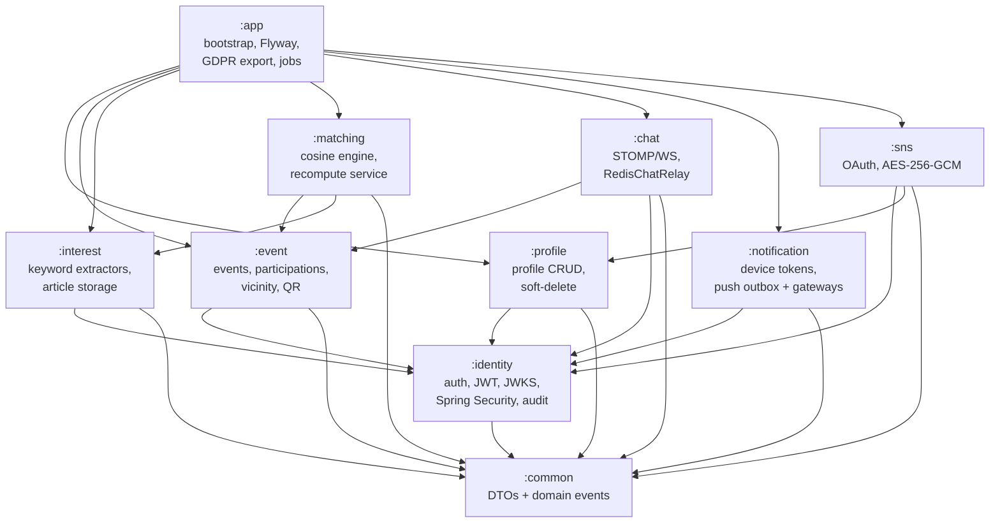
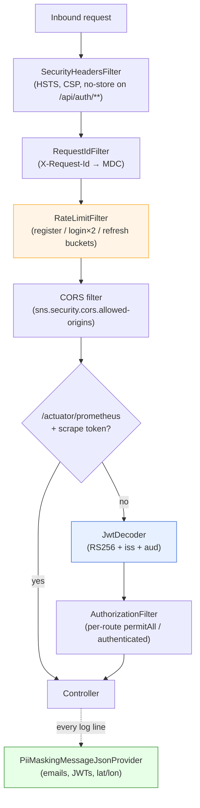
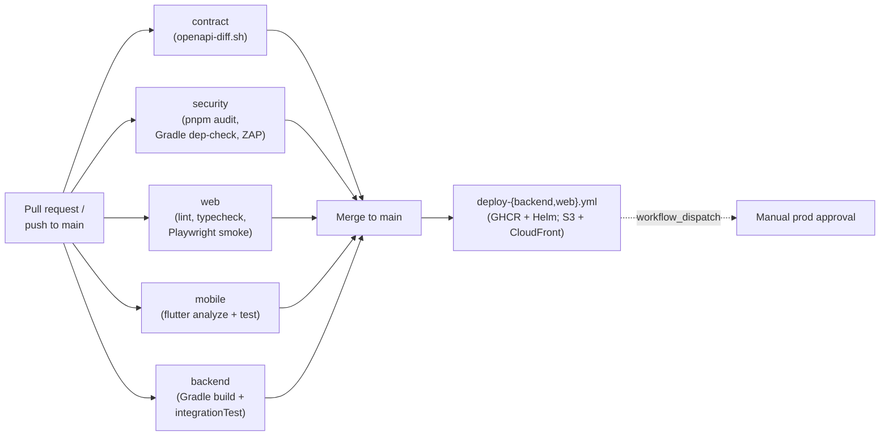
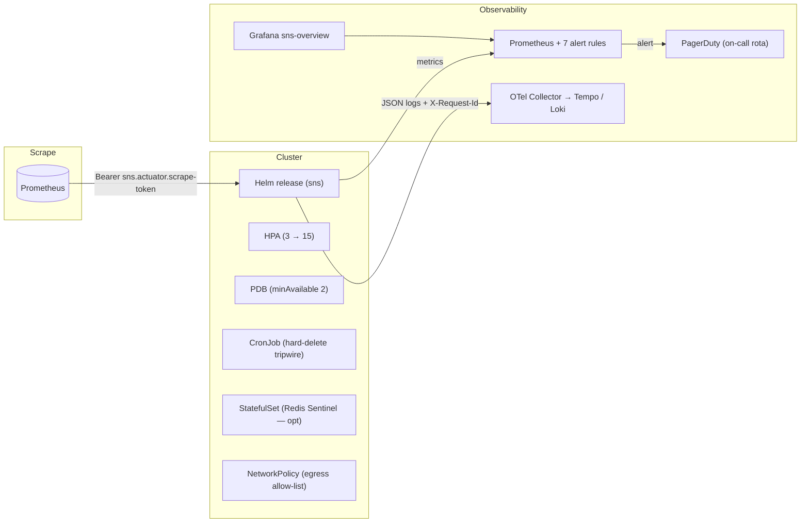

# SNS Conference Tool

> **On-site networking for researchers.** Discover nearby conference attendees who share your interests, then chat with them in real time — without having to memorise badge names or hover at coffee tables.

A multi-platform application — web, mobile, backend — built end-to-end as a reference implementation for [docs/SNS-system.md](docs/SNS-system.md). Designed for production: multi-pod horizontal scale, GDPR-compliant data lifecycle, audit trail, push notifications, and a security posture that refuses to boot if the dev defaults survive into prod.

| | |
|---|---|
| **Status** | Production-ready code; awaits external creds (Firebase, OAuth apps, cluster) |
| **Stack** | Next.js 14 + TypeScript · Flutter 3.22 · Spring Boot 3.3 / Java 21 · PostgreSQL 15 + PostGIS · Redis 7 · Kubernetes + Helm · Terraform |
| **Code shape** | 9-module Gradle backend, 27 React pages, 8 native bridge services, 9 Flyway migrations |
| **Tests** | Unit + Testcontainers integration + Playwright E2E + Flutter widget + k6 load |

---

## Table of contents

1. [What is SNS?](#what-is-sns)
2. [Architecture at a glance](#architecture-at-a-glance)
3. [The canonical user flow](#the-canonical-user-flow)
4. [Status](#status)
5. [Quick start](#quick-start) — Option A: all-in-Docker · Option B: host-side dev
6. [Demo against the real backend](#demo-against-the-real-backend)
7. [Repository layout](#repository-layout)
8. [Backend module graph](#backend-module-graph)
9. [Data model](#data-model)
10. [Performance characteristics](#performance-characteristics)
11. [Security posture](#security-posture)
12. [Tests + CI](#tests--ci)
13. [Operations](#operations)
14. [Documentation index](#documentation-index)

---

## What is SNS?

A conference participant opens the app on their phone, scans the QR code on their badge to join the event, and lists their research interests as text or a PDF abstract. The app extracts keywords, computes cosine similarity against every other participant who has joined, and surfaces a *vicinity* list of nearby people whose interests overlap with theirs. Tapping on a match opens a real-time chat. When the conference ends, the user can export everything they generated (GDPR-compliant ZIP) or delete their account entirely.

> **In one sentence:** "Tinder for academic conferences", but with no swiping, no profile pictures by default, AES-256-GCM-encrypted SNS tokens, and an append-only audit log.

---

## Architecture at a glance



**Three observations from this diagram:**

1. **The mobile app is a thin shell.** Flutter renders a WebView that loads the Next.js frontend; native capabilities reach the web layer through a JSON message bridge. One UI codebase serves both platforms.
2. **Every backend module talks to Postgres; only Event / Chat / Notification touch Redis.** This keeps the modules independently testable — only the realtime + cache paths need a Redis container.
3. **No service-to-service HTTP.** The backend is a modular monolith with cross-module communication via Spring `ApplicationEvent`s — `MatchFound`, `ChatMessageSent`, `LocationUpdated`, `UserJoinedEvent`. New consumers subscribe; producers don't change.

---

## The canonical user flow



---

## Status

> **Production-ready code.** Every code-side gap from the original 5-phase plan plus the follow-up performance and security rounds is closed in `main`.

| Area | What ships |
|---|---|
| **Auth** | RS256 JWT with `iss` + `aud` validation, rotating refresh with reuse-detection family revoke, BCrypt(12) + phantom-hash for unknown emails, constant-time TAN compare, `PasswordPolicy` (length, blocklist, email-equal), JWKS endpoint |
| **Events + Matching** | PostGIS `ST_DWithin` vicinity (Redis-cached 10 s, event-evicted), TF / OpenNLP keyword extraction, **incremental** `recomputeForUser` (O(N)) + scheduled full sweep (O(N²)), HMAC-signed QR tokens alongside legacy hashes |
| **Realtime chat** | STOMP/WS with JWT CONNECT auth, multi-pod fan-out via `RedisChatRelay` over 64 bucketed channels (no `PSUBSCRIBE`), idempotent send via `clientMessageId`, `@Valid` body validation |
| **Push** | DB-backed outbox with `SELECT … FOR UPDATE SKIP LOCKED` claim, `PushGatewayRouter` EnumMap dispatch to `FcmPushGateway` / `ApnsPushGateway` / logging fallback |
| **SNS OAuth** | Facebook + LinkedIn link/callback/unlink, AES-256-GCM token crypto, scheduled enrichment job |
| **GDPR** | `/api/users/me/export` ZIP across profile/interests/matches/chats/SNS, soft-delete + 30-day hard-delete cron, audit-log writes on every actionable path with DB-trigger immutability + 180-day prune |
| **Rate limiting** | Buckets for register / login (per-IP + per-email) / refresh; in-memory or Redisson backend |
| **Transport security** | HSTS, CSP, X-Content-Type-Options, X-Frame-Options, Referrer-Policy, Permissions-Policy, `Cache-Control: no-store` on `/api/auth/**`, CORS allowlist (HTTP + STOMP from one source) |
| **Upload safety** | MIME allowlist + magic-byte sniff on `/api/interests`, 10 MB multipart caps |
| **Actuator** | `/actuator/prometheus` gated by `sns.actuator.scrape-token` (constant-time bearer compare) or JWT |
| **Boot-time gate** | `ProductionSecretsCheck` halts startup under `prod` if any of `sns.qr.hmac-key`, `sns.crypto.master-key`, `sns.audit.ip-salt`, or the JWT keypair is missing / dev-default |
| **Observability** | JSON logs with `X-Request-Id` correlation + `PiiScrubber` masking, Micrometer + OTel OTLP, 7 Prometheus alerts, Grafana dashboard |
| **Deployment** | Helm chart with HPA, PDB, Ingress, CronJob, optional Redis Sentinel StatefulSet, NetworkPolicy; Terraform modules (VPC, PostGIS RDS, ElastiCache Redis, S3, KMS, Route53, ACM) for staging + prod |

**Remaining work is environment-only:**

```
[ ] flutter create — materialise mobile/ios + mobile/android
[ ] gradle wrapper --gradle-version 8.10 — commit the wrapper jar
[ ] dart run build_runner build — generate isar_db.g.dart
[ ] Firebase project + google-services.json + APNs .p8 signing key
[ ] Facebook + LinkedIn OAuth app registration
[ ] AWS account + Terraform state bucket + cluster provisioning
[ ] Store submissions (App Store + Play Store)
```

See [CLAUDE.md › Environment gaps](CLAUDE.md#environment-gaps-cannot-be-done-from-code-alone).

---

## Quick start

Two paths, depending on what you want.

### Option A — All-in-Docker (5 minutes, zero host tooling beyond Docker)

> **Prerequisites:** Docker Desktop. That's it. No host Node, Java, Gradle, or pnpm needed.

One command brings up all six containers:

```bash
cd infra
docker compose -f docker-compose.dev.yml --profile backend --profile web up -d --build
```

After ~3 minutes (cold build) you'll have:

| Container | URL | Role |
|---|---|---|
| **sns-web** | http://localhost:3000 | Next.js 14 dev server (HMR via bind mount — edit `web/` on the host, page reloads) |
| **sns-backend** | http://localhost:8080 | Spring Boot API. `/actuator/health`, `/.well-known/jwks.json`, `/swagger-ui.html` |
| **sns-postgres** | localhost:5432 | PostGIS 15-3.4 — Flyway runs V1–V9 on first start |
| **sns-redis** | localhost:6379 | cache + Pub/Sub + Redisson rate limiter |
| **sns-minio** | http://localhost:9001 | S3 console — login `minio` / `miniosecret` |
| **sns-mailhog** | http://localhost:8025 | inbox where verification TANs land (dev TAN is always `123456`) |

Open http://localhost:3000 — the welcome page renders. By default the `web` service runs with `NEXT_PUBLIC_MOCK_API: "0"`, meaning every `/api/*` call is proxied to the real `backend` container (the seeded Postgres dataset). Log in with `you@example.com` / `Demo!2026` (see [Seeded demo data](#seeded-demo-data) below).

To run frontend-only against the MSW mocks instead — useful for UI work without bringing up Postgres / Redis — edit the `web` service in [`infra/docker-compose.dev.yml`](infra/docker-compose.dev.yml):

```yaml
environment:
  NEXT_PUBLIC_MOCK_API: "1"   # was "0"
```

…then `docker compose -f docker-compose.dev.yml --profile web up -d web` again.

### Seeded demo data

The backend service ships with `SNS_DEV_SEED_DEMO_DATA: "true"` (in [infra/docker-compose.dev.yml](infra/docker-compose.dev.yml)). On a fresh boot — i.e. when the Postgres volume is empty — `DemoDataSeeder` writes the same dataset the MSW fixtures use:

| What                     | Count                                                    |
|--------------------------|----------------------------------------------------------|
| Users + profiles         | 20 (Alex Chen + 19 fellows)                              |
| Conference events        | 3 (NeurIPS Bangkok, ACL Vienna, ICML Montreal expired)   |
| Participations           | 20 NeurIPS + 7 ACL with PostGIS positions near each venue |
| Interests                | 41 (each with real `KeywordExtractor` keywords)          |
| Similarity matches       | ~163 across both active events                           |
| Chat messages            | 19 across 6 threads                                      |

All portraits resolve from `/avatars/*` (the same files Next.js serves out of [web/public/avatars/](web/public/avatars/)). Log in at http://localhost:3000 with:

```
email:    you@example.com
password: Demo!2026
```

A companion `DemoDataKeepalive` (also gated on `sns.dev.seed-demo-data`) bumps `participations.last_update` once a minute so the seeded fellows stay inside `VicinityService`'s 5-minute freshness window indefinitely — the Fellows page never goes blank in dev.

### Management console (`/admin`)

Alex Chen is also seeded as `SUPER_ADMIN` (Lukas Svensson and Rajesh Iyer get `ADMIN`). When the bottom tab bar detects an admin role it grows from 4 tabs to 5 — the new **Registry** tab takes you to the management console. Admins still land on the participant home (`/events/join`) on login like everyone else.

The console shares the participant app's Editorial Ivory chrome (cream `mobile-frame`, top `AppBar`, hairline dividers, brass accents) and keeps the bottom tab bar visible — one tap returns to Discover / Fellows / Letters / Study at any time. A horizontal section nav inside the page lets you move between admin sub-sections.

| Section | What it does |
|---------|--------------|
| **Overview** | Tile-grid: total / active / suspended fellows, active vs. expired sessions, push outbox queue, audit-events-in-last-24h. Refreshes every 30 s. |
| **Sessions** | List + create / edit / delete events. Click a row for the venue heatmap, fellows-in-attendance table, and adjourn-permanently button. |
| **Fellows** | Paged list with email search + role / status filters. Drill in for a full dossier (interests, joined sessions, match count, recent ledger entries) plus suspend / reinstate / soft-delete / hard-delete + role-change controls. |
| **Ledger** | Searchable view over the immutable `audit_log` (filter by actor UUID, action name, since-time). Read-only — the table is protected by a Postgres trigger (Flyway V9). |
| **Apparatus** | Push outbox queue with status filter + per-row retry, plus the same tile-grid as Overview. |

Auth uses the same JWT — there's a `role` claim, `SecurityConfig` gates `/api/admin/**` to `hasAnyRole("ADMIN","SUPER_ADMIN")`, and only `SUPER_ADMIN` can change roles or hard-delete users (last super-admin is protected). For prod, `SNS_ADMIN_EMAIL` must be set or `ProductionSecretsCheck` refuses to start.

Re-seeding wipes the volume:

```bash
docker compose -f infra/docker-compose.dev.yml --profile backend --profile web down -v
docker compose -f infra/docker-compose.dev.yml --profile backend --profile web up -d --build
```

The seeder is idempotent on subsequent boots — it short-circuits when `you@example.com` already exists, so a `docker restart sns-backend` doesn't double-insert. To start with an empty DB instead, set `SNS_DEV_SEED_DEMO_DATA: "false"` (or unset it). The seeder is also explicitly refused under the `prod` profile by `ProductionSecretsCheck`.

**Common operations:**

```bash
# Tail logs from any container
docker logs -f sns-backend
docker logs -f sns-web

# Restart just the backend after a Java change (rebuilds the bootJar)
docker compose -f docker-compose.dev.yml --profile backend up -d --build backend

# Restart just web (TS changes hot-reload automatically; only needed for env / config changes)
docker compose -f docker-compose.dev.yml --profile web restart web

# Bring everything down (data is preserved in named volumes)
docker compose -f docker-compose.dev.yml --profile backend --profile web down

# Wipe data too
docker compose -f docker-compose.dev.yml --profile backend --profile web down -v
```

**Subset selection.** Profiles let you pick exactly what you want:

```bash
# Just the data-plane (Postgres + Redis + MinIO + MailHog) — no app
docker compose -f docker-compose.dev.yml up -d

# Data-plane + backend, run the web on the host with `pnpm dev` (Option B)
docker compose -f docker-compose.dev.yml --profile backend up -d

# Data-plane + web, no backend (web stays in MSW mock mode)
docker compose -f docker-compose.dev.yml --profile web up -d
```

### Option B — Host-side dev (live JVM + Node, fast iteration on backend code)

Use this when you're editing Java and want sub-second restart cycles via Spring DevTools, or you want to attach a debugger.

#### B1. Bring up just the data plane

```bash
cd infra && docker compose -f docker-compose.dev.yml up -d
```

#### B2. Run the backend on the host

First-time only (needs system Gradle 8.10+ + Java 21):

```bash
cd backend && gradle wrapper --gradle-version 8.10
```

Then:

```bash
./gradlew :app:bootRun
```

Backend at `http://localhost:8080`. The dev profile auto-seeds the `NEURIPS2026` event and accepts `123456` as the verification TAN.

#### B3. Run the web on the host

```bash
cd web
pnpm install
pnpm dev
```

Opens at `http://localhost:3000`. To call the real backend instead of mocks, set in `web/.env.local`:

```
NEXT_PUBLIC_MOCK_API=1,-auth,-profile,-events,-interests,-matches,-chat,-devices,-sns
BACKEND_PROXY_TARGET=http://localhost:8080
```

#### B4. (Optional) Run the mobile shell

Prerequisites: Flutter 3.22+, Xcode (iOS) or Android SDK.

First-time only:

```bash
cd mobile
flutter create --platforms=android,ios --project-name=sns_mobile .
dart run build_runner build --delete-conflicting-outputs
```

Then:

```bash
flutter pub get && flutter run
```

The Flutter shell loads the local Next.js dev server (Android emulator: `http://10.0.2.2:3000`; iOS sim: `http://localhost:3000`).

---

## Demo against the real backend

A complete user lifecycle, all via `curl`:

```bash
EMAIL=ada@example.com

# 1. Register — returns 202; TAN goes to MailHog (dev: always 123456)
curl -sS -X POST localhost:8080/api/auth/register \
  -H 'Content-Type: application/json' \
  -d "{\"email\":\"$EMAIL\"}"

# 2. Verify — exchange TAN for verificationToken
TOKEN=$(curl -sS -X POST localhost:8080/api/auth/verify \
  -H 'Content-Type: application/json' \
  -d "{\"email\":\"$EMAIL\",\"tan\":\"123456\"}" | jq -r .verificationToken)

# 3. Complete — set name + password, get bearer pair
TOKENS=$(curl -sS -X POST localhost:8080/api/auth/complete \
  -H 'Content-Type: application/json' \
  -d "{\"verificationToken\":\"$TOKEN\",\"firstName\":\"Ada\",\"lastName\":\"Lovelace\",\"password\":\"correct horse battery staple\"}")
ACCESS=$(echo "$TOKENS" | jq -r .accessToken)

# 4. Join the seeded event
curl -sS -X POST localhost:8080/api/events/join \
  -H "Authorization: Bearer $ACCESS" -H 'Content-Type: application/json' \
  -d '{"eventCode":"NEURIPS2026"}'

# 5. Add an interest (keywords extracted inline)
curl -sS -X POST localhost:8080/api/interests \
  -H "Authorization: Bearer $ACCESS" -H 'Content-Type: application/json' \
  -d '{"type":"TEXT","content":"Graph neural networks with attention"}'

# 6. Drop a GPS fix (rejected silently if < 30 s / < 10 m since the last)
EID=$(curl -sS -H "Authorization: Bearer $ACCESS" localhost:8080/api/events/joined | jq -r '.[0].eventId')
curl -sS -X POST "localhost:8080/api/events/$EID/location" \
  -H "Authorization: Bearer $ACCESS" -H 'Content-Type: application/json' \
  -d '{"lat":13.7,"lon":100.55,"accuracyMeters":5}'

# 7. See who's nearby (Redis-cached 10 s)
curl -sS -H "Authorization: Bearer $ACCESS" \
  "localhost:8080/api/events/$EID/vicinity?radius=100"

# 8. Chat over STOMP — see backend/README.md for a full wscat / Postman recipe.

# 9. GDPR export — ZIP of every byte you've generated
curl -sS -H "Authorization: Bearer $ACCESS" \
  localhost:8080/api/users/me/export -o sns-export.zip

# 10. Soft-delete; hard-deleted by HardDeleteJob 30 days later
curl -sS -X DELETE -H "Authorization: Bearer $ACCESS" localhost:8080/api/users/me
```

---

## Repository layout

```
.
├── web/                Next.js 14 (App Router). MSW contract + per-domain cutover toggle.
├── mobile/             Flutter 3.22 WebView shell.
│                       Bridge + native services: geolocator, mobile_scanner, file_picker,
│                       firebase_messaging, flutter_facebook_auth, Isar.
├── backend/            Spring Boot 3.3 / Java 21 multi-module:
│                       :app :common :identity :profile :event :interest :matching
│                       :chat :notification :sns
├── infra/
│   ├── docker-compose.dev.yml    Postgres+PostGIS, Redis, MinIO, MailHog (+ optional backend).
│   ├── helm/sns/                 Deployment, HPA, PDB, Ingress, CronJob,
│                                 Redis StatefulSet (optional), NetworkPolicy.
│   ├── terraform/                modules/ + environments/{staging,prod}.
│   ├── prometheus/               alert-rules.yaml — 7 alerts from the spec.
│   ├── grafana/                  sns-overview.json dashboard.
│   └── load/                     k6 scenarios — vicinity 500 RPS, chat 1000 WS.
├── docs/
│   ├── SNS-system.md             Full spec.
│   ├── SECURITY.md               Key rotation, secrets, hardening reference.
│   └── runbooks/                 7 alert runbooks + deploy-rollback + db-restore.
└── tools/
    └── openapi-diff.sh           CI-enforced MSW ⊆ OpenAPI contract gate.
```

---

## Backend module graph



**Rule of the road:** there are no reverse or circular module dependencies. Cross-module communication goes through `com.sns.common.events.*` (publish/subscribe). Adding a new producer or consumer doesn't touch the other side.

---

## Data model

```mermaid
erDiagram
    users ||--o| profiles : has
    users ||--o{ refresh_tokens : holds
    users ||--o{ email_verifications : claims
    users ||--o{ interests : owns
    users ||--o{ participations : enters
    users ||--o{ similarity_matches : "is in (a or b)"
    users ||--o{ chat_messages : "sends/receives"
    users ||--o{ device_tokens : registers
    users ||--o{ sns_links : links
    users ||--o{ audit_log : "actor of"
    events ||--o{ participations : hosts
    events ||--o{ similarity_matches : "scoped to"
    events ||--o{ chat_messages : "scoped to"

    users {
        uuid user_id PK
        citext email UK
        bool email_verified
        text password_hash "BCrypt(12)"
        timestamptz created_at
        timestamptz deleted_at "soft-delete window: 30d"
    }
    interests {
        uuid interest_id PK
        uuid user_id FK
        text type "TEXT|ARTICLE_LOCAL|ARTICLE_LINK"
        text content
        text[] extracted_keywords "GIN-indexed"
        jsonb keyword_vector "TF-IDF (L2-normalised)"
    }
    events {
        uuid event_id PK
        text event_name
        timestamptz expiration_code
        text qr_code_hash UK "SHA-256(plaintext)"
        geography centroid "PostGIS POINT,4326"
    }
    participations {
        uuid user_id PK
        uuid event_id PK
        smallint selected_radius "20|50|100"
        geography last_position "GIST-indexed"
        timestamptz last_update
    }
    similarity_matches {
        uuid match_id PK
        uuid event_id FK
        uuid user_id_a FK "user_id_a < user_id_b"
        uuid user_id_b FK
        real similarity
        text[] common_keywords
        bool mutual
    }
    chat_messages {
        uuid message_id PK
        uuid event_id FK
        uuid from_user_id FK
        uuid to_user_id FK
        varchar(4000) content
        text client_message_id "idempotent send"
        bool read_flag
    }
    push_outbox {
        uuid outbox_id PK
        uuid user_id FK
        text kind "match.found|chat.message"
        jsonb payload
        text status "PENDING|DELIVERED|FAILED"
        smallint attempts
    }
    audit_log {
        bigserial id PK
        uuid actor_user_id
        text action
        text ip_hash "SHA-256(ip+salt)"
        jsonb payload "PiiScrubber'd"
        timestamptz created_at "180d retention"
    }
```



**Schema highlights:**

- **`participations.last_position`** is PostGIS `GEOGRAPHY(POINT,4326)` with a GIST index. Vicinity uses `ST_DWithin` against radius (20 / 50 / 100 m) with a 5-minute freshness filter to drop stale fixes.
- **`similarity_matches`** enforces `user_id_a < user_id_b` via a CHECK constraint; the unique pair index is hit directly without `LEAST/GREATEST` function calls.
- **`chat_messages`** has a unique `(from_user_id, client_message_id)` index. Reconnect replays return the original row instead of duplicating.
- **`push_outbox`** is consumed by the drain via `SELECT … FOR UPDATE SKIP LOCKED` so multiple pods drain in parallel without picking the same row.
- **`audit_log`** has a `BEFORE UPDATE OR DELETE` trigger that throws unless the prune job's session GUC is set. Append-only at the database level — application code can't tamper with it.

---

## Performance characteristics

| Hot path | Optimisation |
|---|---|
| **Matching on interest edit (1 user, 1000-participant event)** | Incremental `recomputeForUser` — O(N), not O(N²). ~999 pair comparisons instead of ~500 000. |
| **Vicinity query** | CTE-hoisted `me`; `LEAST/GREATEST` removed from the canonical-pair JOIN so `idx_matches_pair` is hit directly; Redis cache 10 s TTL with event-keyed evict on `LocationUpdated` + `MatchRecomputeRequested`. |
| **Cross-pod chat fan-out** | 64 bucketed channels via `SUBSCRIBE` instead of `PSUBSCRIBE ws:chat:*` — Redis dispatch is O(1) per publish. |
| **Push outbox drain** | `FOR UPDATE SKIP LOCKED` claim + delivery outside the locking transaction. Concurrent drains never collide; lock duration ≈ a single UPDATE. |
| **Push gateway dispatch** | `EnumMap<Platform, PushGateway>` resolved once at construction. No per-delivery class-name scan. |
| **Hard-delete + SNS enrichment + audit prune** | Paged through stale rows only. Never `findAll()` against multi-million-row tables. |
| **`/api/events/joined`** | Single `JOIN` query. Replaces the prior `findByUserId → loop findById` N+1. |

**Spec SLOs (from §18):** chat p95 < 200 ms (1000 WS at 10 msg/s), vicinity p95 < 300 ms (500 RPS), match recompute < 5 s for 1000 participants. The k6 scenarios in [`infra/load/`](infra/load/) drive these.

---

## Security posture



| Layer | Defence |
|---|---|
| **Brute force** | Rate buckets: register 5/h/IP, login 30/h/IP + 10/h/email, refresh 60/h/IP. Backed by in-memory or Redisson. |
| **User enumeration** | `AuthService.login` runs BCrypt against `PHANTOM_HASH` for unknown emails. Wall-clock matches the bad-password branch. |
| **Token theft** | Refresh-token rotation; reuse of a revoked token revokes the entire `replaced_by` family + every other live token for that user. Audit emits `auth.refresh.reuse_detected`. |
| **JWT spoofing** | `iss` + `aud` validated by `JwtValidators.createDefaultWithIssuer` + `JwtClaimValidator`. Tokens minted in another env with the same key are rejected. |
| **Weak passwords** | `PasswordPolicy` rejects < 8 chars, equal to email local-part, or top-100 blocklist matches. |
| **CORS bypass** | One `sns.security.cors.allowed-origins` CSV serves both HTTP and STOMP. Default = same-origin only. |
| **Polyglot uploads** | MIME allowlist + magic-byte sniff on `/api/interests`. 10 MB cap. |
| **Internal metric scraping** | `/actuator/prometheus` requires the `sns.actuator.scrape-token` bearer (constant-time compare). |
| **Audit tampering** | Postgres trigger blocks UPDATE / DELETE on `audit_log` unless the prune job's GUC is set. 180-day retention. |
| **Dev defaults in prod** | `ProductionSecretsCheck` halts boot under `prod` profile if any secret holds its dev default. |
| **Cached bearer tokens** | `Cache-Control: no-store` on every `/api/auth/**` response. |

Full reference: [docs/SECURITY.md](docs/SECURITY.md).

---

## Tests + CI



| Test layer | Tool | Coverage |
|---|---|---|
| **Backend unit** | JUnit 5 | `SimilarityEngineTest`, `TfKeywordExtractorTest`, `QrCodeServiceTest`, `AesGcmCipherTest`, `PiiScrubberTest`, `PasswordPolicyTest`, `PushGatewayRouterTest` |
| **Backend integration** | Testcontainers (Postgres + Redis) | `AuthIntegrationTest`, `EventAndMatchingIntegrationTest`, `ChatIntegrationTest`, `AuditLogIntegrationTest` — all extend `IntegrationTestBase` |
| **Web E2E** | Playwright | `web/e2e/smoke.spec.ts` walks register → verify → complete → join → vicinity → chat |
| **Mobile** | `flutter_test` | `mobile/test/bridge/js_bridge_test.dart` covers the dispatch table |
| **Contract** | Bash + ripgrep | `tools/openapi-diff.sh` asserts every MSW route has a matching OpenAPI path |
| **Load** | k6 | `infra/load/k6-vicinity.js` (500 RPS), `infra/load/k6-chat.js` (1000 WS at 10 msg/s) |
| **Security** | `pnpm audit`, OWASP `dep-check`, ZAP baseline | Wired into the `security` CI job |

---

## Operations



**On-call.** Seven Prometheus alerts with per-alert runbooks under [docs/runbooks/](docs/runbooks/), plus operational procedures for [deploy-rollback](docs/runbooks/deploy-rollback.md) and [db-restore](docs/runbooks/db-restore.md).

**Deploys.** GitHub Actions:
- `deploy-backend.yml` builds + pushes to GHCR, runs `helm upgrade --install --wait`.
- `deploy-web.yml` builds the Next.js bundle and syncs to S3 + CloudFront.
- `deploy-mobile.yml` runs fastlane (Play internal track + TestFlight) — gated on `workflow_dispatch`.

**Rollback.** `helm rollback sns <revision>`. The CronJob tripwire keeps the in-process hard-delete scheduler honest in case the JVM Quartz instance stalls.

---

## Documentation index

| Doc | Purpose |
|---|---|
| [docs/SNS-system.md](docs/SNS-system.md) | Authoritative spec. 20 sections: architecture, data model, API contracts, scaling, observability, GDPR, security. |
| [CLAUDE.md](CLAUDE.md) | Contributor guide. Commands per layer, architecture deep-dive, environment gaps. |
| [docs/SECURITY.md](docs/SECURITY.md) | Key rotation procedures, hardening reference, residual risks, boot-time gate. |
| [backend/README.md](backend/README.md) | Backend setup, Gradle commands, full configuration reference (~50 properties), `curl` walkthrough. |
| [mobile/README.md](mobile/README.md) | Mobile setup, bridge service table, first-time provisioning checklist. |
| [infra/load/README.md](infra/load/README.md) | k6 scenarios + run instructions. |
| [infra/terraform/README.md](infra/terraform/README.md) | Terraform module + environment layout. |
| [docs/runbooks/README.md](docs/runbooks/README.md) | On-call runbook index. |
| [.claude/plans/lively-dreaming-thimble.md](.claude/plans/lively-dreaming-thimble.md) | Latest implementation plan (security hardening round). |

---

## Contributing

This repo grew via successive in-conversation rounds with a coding agent — see the commit log for the chronology (`d59cf95` Pass-1 mocks → `2f2ba75` security hardening). The architectural rules that hold across every round:

1. **Modules don't depend on each other in cycles.** Cross-module hooks go through `com.sns.common.events.*`. New consumer → add a listener; new producer → add a publish call.
2. **The MSW handler file is the source of truth for the REST shape.** When a backend endpoint replaces a mock, the OpenAPI spec inherits the contract; `tools/openapi-diff.sh` enforces the link.
3. **Production behaviour ships behind interfaces.** `PushGateway`, `KeywordExtractor`, `RateLimiter`, `ChatRelay` all have a default + a real implementation gated on `@ConditionalOnProperty`. Swapping is a config change, not a code change.
4. **No dev defaults in prod.** `ProductionSecretsCheck` enforces this at boot.

License: TBD — placeholder `security@sns.example.com` until the project is formally released.
